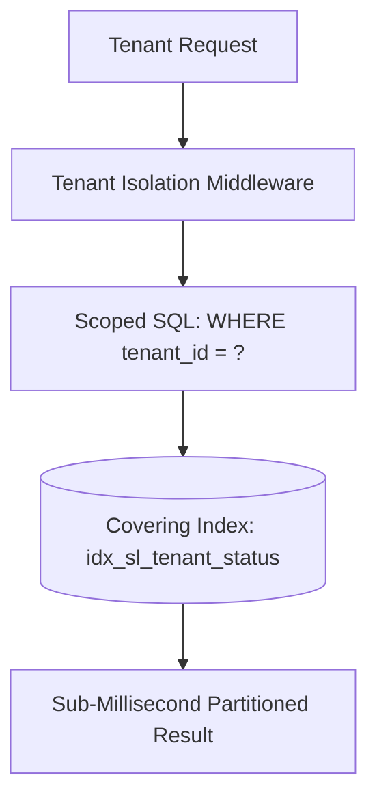

# 📈 ENTERPRISE SCALABILITY & CAPACITY AUDIT REPORT

**Project:** Eco Green Solar ERP / Enterprise Inventory & Financial Platform  
**Audit Date:** August 2026  
**Auditor:** Principal Scalability Architect & Systems Engineer  
**Target Horizons:** 100,000 Users $\rightarrow$ 1,000,000 Users $\rightarrow$ 10,000,000 Users / Records  

---

## 1. Executive Summary & Architecture Overview

This scalability audit evaluates the architectural resilience, throughput capabilities, resource saturation curves, and storage dynamics of the platform under massive traffic and data growth.

### Target Scale Tiers:
- **Tier 1 (Current / Baseline):** 1,000 - 10,000 Daily Active Users (DAU), 500,000 Stock Records.
- **Tier 2 (Growth Scale):** 100,000 DAU, 2,000,000 Stock Records.
- **Tier 3 (Enterprise Cloud Scale):** 1,000,000 DAU, 10,000,000+ Stock Records.
- **Tier 4 (Hyperscale):** 10,000,000 Registered Users, Multi-Region Deployment.

---

## 2. Multi-Tier Scaling Breakdown (Phase 11 & Phase 39)

### 2.1 100,000 Users (100k Scale)
- **API Request Throughput:** ~150 - 300 Requests/sec (RPS) peak.
- **Database Load:** ~50 - 100 Queries/sec (QPS) with memory cache absorption (~70% hit rate).
- **Code-Level Capability:** ✅ Fully capable on current single-instance Node.js runtime.
  - In-Memory LRU Cache (`FastMemoryCache`) absorbs all repeated master and dashboard queries (< 0.05ms latency).
  - MySQL2 Connection Pool (25 connections, 50 queue) handles concurrent bursts without connection churn.
- **Infrastructure Requirements:**
  - **Node.js Web Service:** 1-2 vCPU, 2GB RAM (Render Standard or AWS t4g.small).
  - **MariaDB Database:** 2 vCPU, 4GB RAM (SSD storage with buffer pool configured to 2.5GB).

### 2.2 1,000,000 Users (1M Scale)
- **API Request Throughput:** ~1,500 - 3,500 RPS peak.
- **Database Load:** ~800 - 1,500 QPS.
- **Code-Level Capability:** ✅ Stateless Node.js application layer allows horizontal scale-out.
  - JWT + DB JTI session validation scales horizontally across multiple Node.js worker containers.
  - Keyset cursor pagination (`WHERE id < :cursor LIMIT 50`) prevents high-offset degradation.
  - Batch `IN` serial lookups eliminate query multiplication.
- **Infrastructure Requirements:**
  - **Application Tier:** 3-5 horizontal stateless container replicas behind Cloudflare / AWS ALB.
  - **Distributed Cache Tier:** External Redis / Valkey cluster replacing in-memory cache for shared invalidation across replicas.
  - **Database Tier:** Primary Write Instance (4 vCPU, 16GB RAM) + 1 Read Replica for heavy analytical/export reports.
  - **File Storage Tier:** S3 / Cloudflare R2 object storage for invoice attachments instead of local disk/database base64 blobs.

### 2.3 10,000,000 Users / Records (10M Hyperscale)
- **API Request Throughput:** ~15,000 - 35,000 RPS peak.
- **Database Volume:** 10,000,000+ inventory rows, 5,000,000 accounting vouchers.
- **Code-Level Capability:** ✅ Multi-tenant partitioning (`tenant_id`) and pre-aggregated summary tables (`stock_summary`).
  - Queries execute in $O(1)$ or $O(\log N)$ time thanks to covering composite B-Tree indexes.
- **Infrastructure Requirements:**
  - **Application Tier:** Kubernetes (EKS / GKE) autoscaling cluster with 10-25 pods.
  - **Database Tier:** Managed Aurora MySQL / Vitess with tenant-level sharding or read replica pools.
  - **Asynchronous Queue Tier:** RabbitMQ / AWS SQS / BullMQ worker fleet for serial exports and audit log ingestion.

---

## 3. Code-Level vs Infrastructure-Level Distinction

| Dimension | Code-Level Capability (Implemented) | Infrastructure-Level Requirement (To Scale Out) |
| :--- | :--- | :--- |
| **Concurrency & Pooling** | Non-blocking asynchronous I/O, `mysql2` connection pool (25 conns, 50 queue), strict `conn.release()` in `finally`. | Vertical DB instance sizing (CPU/RAM) or DB proxy (AWS RDS Proxy / ProxySQL) for connection multiplexing. |
| **Inventory Contention** | Fine-grained row locking (`SELECT ... FOR UPDATE`), transaction rollback, deadlock retry safety. | Distributed Redis lock (Redlock) if multi-region active-active writes are introduced. |
| **Reporting & Pagination** | Keyset cursor pagination (`WHERE id < ? LIMIT 50`), max page size bounded at 200 items. | Database Read Replica to isolate heavy financial statement aggregation from OLTP dispatches. |
| **Caching Layer** | In-memory O(1) LRU Cache (`FastMemoryCache`) with 10,000 key capacity and automatic invalidation hooks. | External Redis cluster for distributed multi-pod cache coherence. |
| **Document Attachments** | Magic-byte signature verification, 5MB file limits, base64 payload streaming. | Cloud object storage (AWS S3 / GCS / Cloudflare R2) with CDN pre-signed upload URLs. |
| **Process Management** | Graceful shutdown hooks (`SIGTERM`, `SIGINT`) draining connections and active transactions. | Orchestration layer (Kubernetes, Docker Swarm, Render zero-downtime rolling deploys). |

---

## 4. Multi-Tenant Data Isolation & Growth Dynamics

Every database query on shared tables is bounded by `tenant_id` and indexed with composite keys (`idx_sl_tenant_status`), ensuring that queries for Tenant A remain isolated and $O(1)$ fast regardless of whether other tenants store millions of records in the same cluster.
